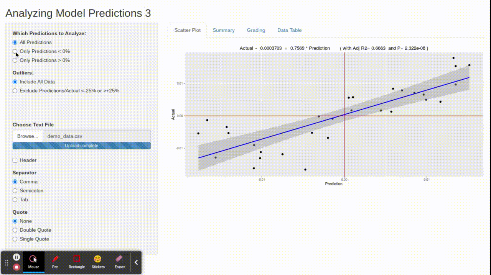

# Trading Signal Evaluation

Simple Shiny app to demonstrate visual evaluation of trading signals/recommendations.

### Public App Hosting

A version is available at [shinyapps.io](https://kbakh.shinyapps.io/AnalyzingPredictions3/).  For test data, **demo/demo_data_1.csv** can be used.

### Not a Backtest

The primary goal is to take a flat file of historical signals, group such signals into 6 quantiles (e.g. most bullish into 'A' bucket, most bearish into 'F' bucket), and finally visually evaluate the actual performance of each 'bucket.'  

##### All Signals vs Buy-only Signals vs Sell-only Signals
The sidebar on the left of the app allows user to evaluate all signals, 'buys' only (i.e. predictions > 0%), or 'sells' only (i.e. predictions < 0%).

##### Summarizing Avg Actual Performance of Each Bucket 
The 'Grading' tab on top of the app summarizes actual performance for each 'bucket' of signals.

### Input File Format (e.g. csv, tsv, txt)
Use the sidebar on the left of the app to upload a file with the following format:

Column 1: unique signal_ID

Column 2: symbol

Column 3: date *(can be expanded to date-time with min coding)*

Column 4: signal: as expected return (e.g. 0.009 => expecting a 0.9% increase in price) *(can be relative or absolute return)*

Column 5: actual return *(can be relative or absolute return)*

### Notes

1. This demo represents each "signal" as a single point-estimate (e.g. -0.01 means expected return of -1% over a given time horizon).

In practice, our signal-generating model may represent "signals" with both a point-estimate and a confidence/conviction estimate (e.g. -1% return with 51% conviction) or even present a full distribution for the expected return.  In this case, an update to this simple app would be required.

2. Obviosuly, both "signal" and "actual return" should be over the same time horizon. 
